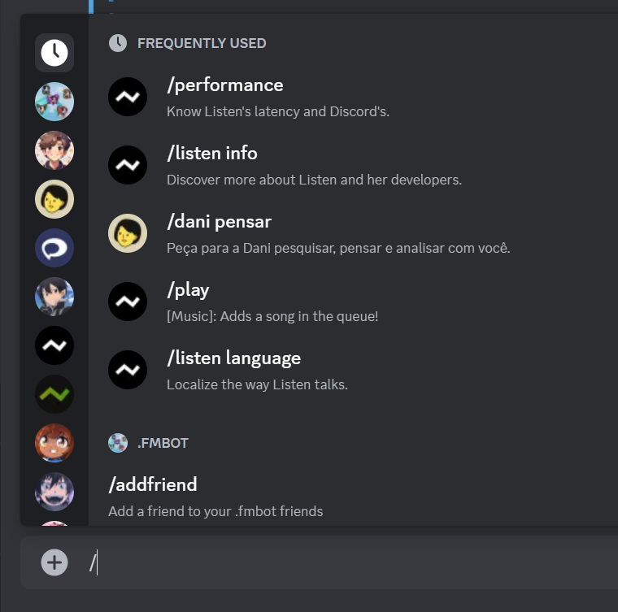
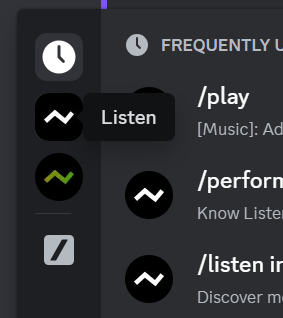
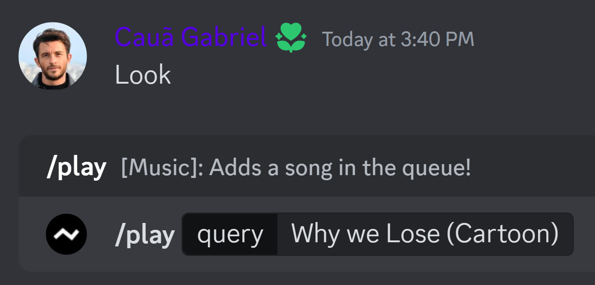

import { Callout, Steps, Tabs } from "nextra/components";

# How to run commands on Discord?

{/* Tutorial for Slash: */}

<Steps>
### Start by pressing `/` on your keyboard

On Discord, you can execute commands using **Slash Commands**, visit a text channel and press `/` on your keyboard, like you're sending a message. This will open the command menu.

Figure 1: Inserting Slash to access the App Menu.

### Select `Listen` in the list of apps

Select **Listen** by clicking on her avatar in the top corner of the menu.

Figure 2: Selecting Listen.

### Enter your command

{/* Tutorial for Prefix: */}

##### How to execute a command?

<Tabs items={['App Menu', 'Natural Language',]}>

  <Tabs.Tab>
    Select the command you want to use and press enter!
  
    <Callout type="info">
    Example: **`/play`** `Why we Lose`

    
    </Callout>

  </Tabs.Tab>
  <Tabs.Tab>
    You can use prefix commands by sending Listen + the name of your command.

    <Callout type="info">
    Example: **`Listen play`** `Why we Lose from Cartoon`
    </Callout>

  </Tabs.Tab>
</Tabs>
</Steps>

## List of Commands

<Callout type="default" emoji="">
  **Help:** To get the command list, visit this section:
</Callout>
