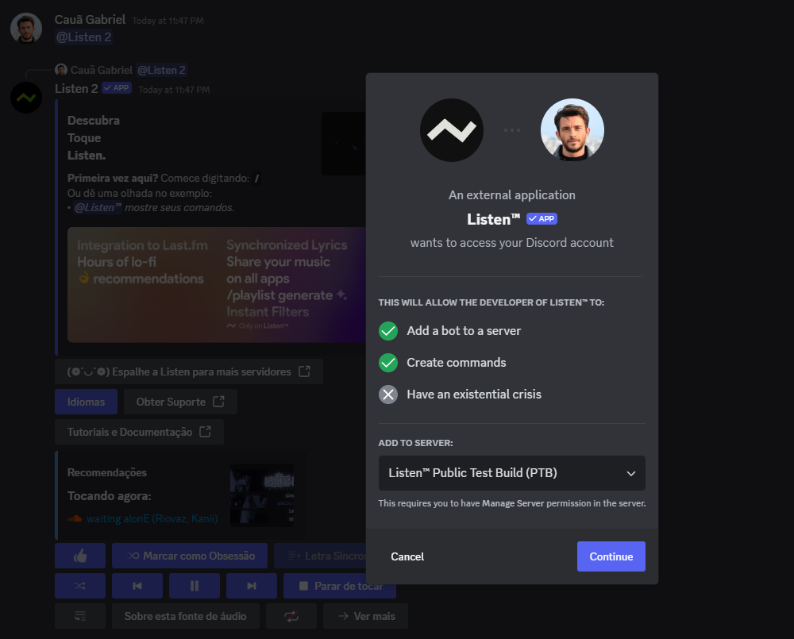

import { Steps, Callout, Cards, Card } from "nextra/components";

# Introduction

Here's a quick getting started guide just to explain how to get the best audio experience you can with Listen.

<Steps>
### Inviting the bot on your server

Click [here](https://discord.com/api/oauth2/authorize?client_id=777401960793636934&permissions=277129317376&scope=bot%20applications.commands) to add only one **Listen** to your server, and [here](https://discord.com/api/oauth2/authorize?client_id=1107811197950103653&permissions=277129317376&scope=bot%20applications.commands) to get **Listen on Double** on your servers, for free.

By default, Listen is asking basic permissions. 
<Callout type="error" emoji="">
We don't recommend to change that.
</Callout>

But, you can find a link [here](https://discord.com/oauth2/authorize?client_id=1107811197950103653&permissions=8&scope=bot%20applications.commands) with Administrator privileges.

<Callout type="info">
  You will be redirected to a Discord prompt. First click Continue and then hit Authorize.
</Callout>

Figure 1: Screenshot of the authorization popup.

### Ready to rock and roll
To learn how to use Listen, you can check to following sections:
<Cards>
  <Card icon="" title="How to use commands" href="/how-to-commands" />
  <Card icon="" title="How to use commands of those bots in Discord." href="/how-to-commands" />
  <Card icon="" title="How to use commands of those bots in Discord." href="/how-to-commands" />
</Cards>

</Steps>
